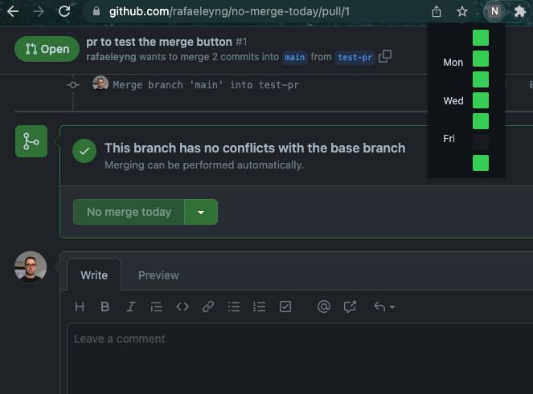

# no-merge-today

This is a PR just to test the merge button.

A [Chrome extension](https://chrome.google.com/webstore/detail/no-merge-today/iikbekjkpkkbfbaalmdaidjaenjjmlpd) to block the Github merge button on specific days.

## permissions

This extension declares 3 permissions in its manifest.json
- `tabs`: is needed so if multiple tabs are open in Github pull request pages, all tabs can be notified of configuration changes in the action popup (like toggling merge on any day on/off);
- `storage`: is needed to store the configuration of in which days the merge buttons should be blocked. It is also used to sync this config to your profile (if you login in with your profile in another Chrome instance, it should retrieve the same config);
- `webNavigation`: is needed to correctly trigger the check for the buttons when doing a client-side navigation, without a full page reload, such as what happens when you are in `/pulls` inside some repository and clicks on any PR. If, instead, you navigate directly to the PR URL, a full page reload happens, but this permission is still needed for the other cases.

## TODO

- [X] work when navigating directly to a PR link (full page load);
- [X] work when navigating from anywhere inside Github to the PR link (possibly a client-side render without full reload);
- [X] work when changing the config on the action popup;
- [X] work observing changes to the DOM that can be caused by changing the state of a PR;
- [X] show action icon with different colors (green/gray) according to the configuration for the current day;
- [ ] detect end of current day/begin of new day, set PR button and extension icon accordingly;
